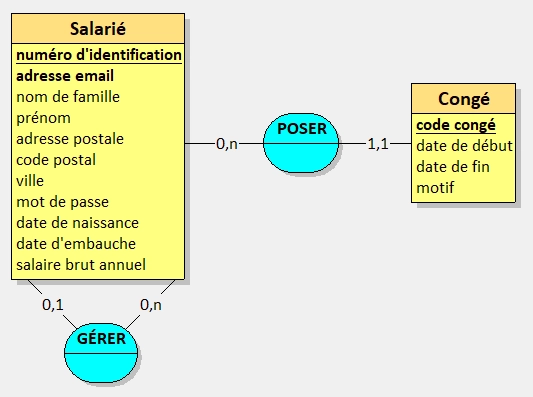

# _(<abbr title="Développeur Web et Web Mobile">DWWM</abbr> 2023)_ <abbr title="Compétence Professionnelle">CP</abbr> 5 - Mettre en place une base de données relationnelle
> [REAC _(24/05/2023)_, pages 23 et 24](https://www.banque.di.afpa.fr/EspaceEmployeursCandidatsActeurs/EGPResultat.aspx?ct=01280m04&type=t)  
> [RE _(24/05/2023)_, page 11](https://www.banque.di.afpa.fr/EspaceEmployeursCandidatsActeurs/EGPResultat.aspx?ct=01280m04&type=t)

## 🚀 Contexte

Le front-end : c'est **fini** !  
Mais avant de nous attaquer au back-end d'un point de vue code, on va voir ce qui est attendu dans cette <abbr title="Compétence Professionnelle">CP</abbr> qui parle de la mise en place d'une base de données relationnelle.

??? question "Mais attend ! J'ai juste une base de données non relationnelle à mettre en place, c'est bon ?"
    J'aurai aimé te dire que oui, mais ça va être un poil trop léger pour cette compétence...  
    Mais garde sous la main ta base de données non relationnelles pour la prochaine compétence, ça te servira 😉

Commençons par le commencement : **comment créer une base de données relationnelle ?**

Il y a pléthore de possibilités, mais ici on va s'attarder sur une méthodologie française _(cocorico 🐓)_ qui est la méthode **Merise**.  
On va se baser sur différents schémas issus de la méthode Merise pour créer notre base de données relationnelle, à savoir :

- Le **dictionnaire des données** : qui va recenser toutes les données que l'on va stocker par la suite dans notre base de données
- Le **MCD** _(Modèle Conceptuel des Données)_ : qui va représenter les données et leurs relations, sous la forme d'entités et d'associations dans un schéma graphique
- Le **MLD** _(Modèle Logique des Données)_ : qui va représenter les données sous forme de tables et de relations, dans un schéma graphique
- Le **MRD** _(Modèle Relationnel des Données)_ : qui va représenter les mêmes informations que le <abbr title="Modèle Logique des Données">MLD</abbr>, mais cette fois-ci en format texte
- Le **MPD** _(Modèle Physique des Données)_ : qui va représenter les données sous forme de tables et de relations, en intégrant les types de données et les contraintes

## 🗂️ Le dictionnaire des données

L'objectif du dictionnaire des données est de recenser toutes les données que l'on va stocker dans notre base de données.  
L'idée est qu'il soit très simple et compréhensible par tout le monde, même par quelqu'un qui n'y connaît rien en base de données.

??? example "Exemple simplifié de dictionnaire des données"
    | Nom de la donnée                   | Format         | Longueur |
    |------------------------------------|----------------|----------|
    | Numéro d'identification du salarié | Alphanumérique | 30       |
    | Prénom du salarié                  | Alphabétique   | 30       |
    | Nom de famille du salarié          | Alphabétique   | 30       |
    | Adresse email du salarié           | Alphanumérique | 80       |
    | Adresse postale du salarié         | Alphanumérique | 60       |
    | Code postal du salarié             | Aphanumérique  | 9        |
    | Ville du salarié                   | Alphabétique   | 30       |
    | Mot de passe du salarié            | Alphanumérique | 80       |
    | Date de naissance du salarié       | Date           | 8        |
    | Manager du salarié                 | Alphabétique   | 30       |
    | Début de congé du salarié          | Date           | 8        |
    | Fin de congé du salarié            | Date           | 8        |
    | Motif de congé du salarié          | Alphabétique   | 30       |
    | Date d'embauche du salarié         | Date           | 8        |
    | Salaire brut annuel du salarié     | Numérique      | 6        |

On peut constater qu'on ne fait apparaître aucun terme technique, on se contente de décrire les données de manière simple et compréhensible.  
Grossièrement, voici les formats que l'on peut retrouver dans un dictionnaire des données :

- **Alphabétique** : pour les chaînes de caractères contenant uniquement des lettres
- **Alphanumérique** : pour les chaînes de caractères contenant des lettres et des chiffres
- **Numérique** : pour les nombres
- **Date** : pour les dates
- **Vrai/Faux** : pour les données booléennes

??? question "Mais pourquoi le code postal est marqué en alphanumérique et 9 caractères ?"
    C'est une bonne question !  
    En France on est habitués à voir des codes postaux sur 5 chiffres, mais il existe des codes postaux qui contiennent des lettres _(comme au Royaume-Uni par exemple)_.

    On peut également constater que dans d'autres pays, le code postal n'est pas sur 5 caractères mais sur 6, 7, 8 voire 9 !  
    Pensez à vous renseigner sur les pays que vous ciblez pour votre application, ça peut vous éviter des erreurs de conception 😉

## 📊 Le MCD

Tout comme le dictionnaire des données, le MCD a pour objectif de représenter les données et leurs relations, mais cette fois-ci sous forme graphique.  
On va également découper davantage nos données en les faisant apparaître dans des entités distinctes.

On fera attention à ne pas être technique, comme pour le dictionnaire des données, et on va se contenter de représenter les données et leurs relations.  
Ce document est avant tout destiné à être compris par tout le monde, notamment le client final.

??? example "Exemple de MCD"
    

    Sur ce schéma, on peut distinguer deux entités : **Salarié** et **Congé**. Elles sont représentées par des rectangles et contiennent leurs différentes propriétés.   
    On peut également remarquer d'autres éléments, comme des "bulles" bleues qui représentent les relations entre les entités. On y retrouve des verbes à l'infinitif qui décrivent la relation entre les entités.

    Mais entre ces verbes et les entités, il y a des chiffres _(et parfois un `n` qui se balade)_, ce sont les fameuses **cardinalités**.

    Ce schéma nous apprend donc que :

    - Salarié - GÉRER - Salarié _(Relation récursive)_
        - Un même salarié peut gérer plusieurs autres salariés _(`Salarié 0,n` - GÉRER - `Salarié 0,1`)_
        - Un salarié peut n'avoir aucun ou qu'un seul manager _(`Salarié 0,1` - GÉRER - `Salarié 0,n`)_
    - Salarié - POSER - Congé
        - Un salarié peut poser plusieurs congés _(`Salarié 0,n` - POSER - `Congé 1,1`)_
        - Un congé est posé par un et un seul salarié _(`Congé 1,1` - POSER - `Salarié 0,n`)_

    !!! question "Mais pourquoi il n'y a pas les ID dans le schéma ?"
        Ni les clés étrangères d'ailleurs...  
        Tout simplement parce que les ID ne sont pas des données à proprement parler. Ce sont avant tout des identifiants qui permettent de différencier les entités entre elles, d'un point de vue technique.

        Sauf s'il s'agit d'une donnée concrète _(comme le numéro de badge de salarié, un numéro de sécurité sociale, etc.)_, on ne les fait pas apparaître dans le <abbr title="Modèle Conceptuel des Données">MCD</abbr>.
        Cependant, on peut noter que ce n'est pas pour autant que nous n'avons pas de discriminant dans nos entités ! On peut très bien voir la propriété `adresse email` dans l'entité `Salarié` qui pourrait servir de discriminant, puisque chaque salarié a une adresse email unique.

Ce document peut être réalisé à l'aide de divers outils, mais je vous recommande chaudement le logiciel [Looping](https://www.looping.fr/) qui est gratuit et très simple d'utilisation.

!!! warning "Compatibilité de Looping"
    Attention cependant, Looping n'étant conçu que pour Windows, il faudra exécuter le logiciel avec [Wine](https://www.winehq.org/) si vous êtes sous Linux ou MacOS.

## 📈 Le <abbr title="Modèle Logique des Données">MLD</abbr>

Cette fois-ci, on va passer à la vitesse supérieure en représentant nos données sous forme de tables et de relations !  
Les termes techniques ont alors entièrement leur place dans ce document, puisqu'il est destiné aux développeurs qui vont mettre en place la base de données.

??? example "Exemple de MLD"
    _Schéma en cours de création_

## 📑 Le <abbr title="Modèle Relationnel des Données">MRD</abbr>

La plupart du temps, le <abbr title="Modèle Relationnel des Données">MRD</abbr> est réalisé sous le nom de <abbr title="Modèle Logique des Données">MLD</abbr> mais en format texte.  
En réalité, le <abbr title="Modèle Relationnel des Données">MRD</abbr> est la représentation textuelle du <abbr title="Modèle Logique des Données">MLD</abbr>.

On peut donc dire qu'au choix, on peut soit faire un <abbr title="Modèle Logique des Données">MLD</abbr> sous forme de schéma, soit sous forme de texte _(et dans ce cas, on parle de <abbr title="Modèle Relationnel des Données">MRD</abbr>)_.  
Mais si on a l'occasion de faire les deux, c'est encore mieux !

??? example "Exemple de MRD"
    _Schéma en cours de création_

## 📦 Le <abbr title="Modèle Physique des Données">MPD</abbr>

Maintenant on ne rigole plus, on met les mains dans le cambouis ! 🧑‍🔧

Puisque tous nos schémas sont prêts, on va pouvoir passer à la création de notre base de données.  
Mais si on y repense, notre <abbr title="Modèle Logique des Données">MLD</abbr> représente déjà bien notre base de données, non ?

Pas entièrement... car il nous manque les types de données !  
Si on reprend notre dictionnaire des données, on avait pu inscrire "Alphabétique" et d'autres formats génériques pour nos données. Mais ces termes n'existent pas _(du moins, pas tous)_ dans les bases de données.

??? warning "Spécificités des <abbr title="Système de Gestion de Base de Données">SGBD</abbr>"
    Selon le <abbr title="Système de Gestion de Base de Données">SGBD</abbr> que vous utilisez, les types de données peuvent varier, référez-vous donc à la documentation de votre <abbr title="Système de Gestion de Base de Données">SGBD</abbr> pour connaître les types de données disponibles 😉

Au passage, le <abbr title="Modèle Physique des Données">MPD</abbr> peut se décliner dans deux formats :

- **Le format texte** : qui reprend les informations du <abbr title="Modèle Logique des Données">MLD</abbr> en y ajoutant les types de données et les contraintes. En réalité, il s'agira d'un script SQL qui permettra de créer la base de données et toutes ses tables.
- **Le format graphique** : qui reprend les informations du <abbr title="Modèle Logique des Données">MLD</abbr> en y ajoutant les types de données et les contraintes, mais sous forme de schéma.

Cependant je mets en garde sur le format graphique et la notation que peuvent proposer certains logiciels. Vous avez peut-être eu l'occasion de voir des schémas avec des flèches, des carrés, des ronds, des losanges ou encore des pattes de corbeau...
Cette notation est propre à un langage de modélisation, le **UML** _(Unified Modeling Language)_, qui ne correspond pas à la méthode Merise.

Dans la méthode Merise, on utilisera simplement des lignes pleines pour représenter les relations entre les tables, et des carrés pour représenter les tables.  
On retrouvera tout de même des lignes fléchées pour illustrer nos relations dans le <abbr title="Modèle Logique des Données">MLD</abbr>, mais c'est tout.

<abbr title="Unified Modeling Language">UML</abbr> est un excellent langage de modélisation, mais on y reviendra davantage dans le cursus <abbr title="Concepteur Développeur d'Applications">CDA</abbr> 😉

??? example "Exemples de <abbr title="Modèle Physique des Données">MPD</abbr> _(textuel et graphique)_"
    _Schémas en cours de création_

## 📝 Critères d'évaluation
!!! abstract "Critères d'évaluation"
    - Les données du schéma conceptuel et leurs relations sont identifiées et prises en compte
    - Le schéma physique est conforme aux besoins exprimés dans le dossier de conception et respecte les règles des bases de données relationnelles
    - Les règles de nommage sont respectées
    - La sécurité, l’intégrité et la confidentialité des données est assurée
    - La base de données de tests mise en place est conforme au schéma physique
    - Les utilisateurs sont créés avec leurs droits respectifs conformément au dossier de conception
    - La base de données créée est sauvegardée et elle peut être restaurée en cas d’incident
    - La documentation technique des bases de données est comprise, en langue française ou anglaise _(niveau B1 du CECRL pour l’anglais)_

---

## 📚 Documentations

- [Éditions ENI - Merise - Guide pratique _(3e édition)_, par **Jean-Luc Baptiste**](https://www.editions-eni.fr/livre/merise-guide-pratique-3e-edition-modelisation-des-donnees-et-des-traitements-manipulations-avec-le-langage-sql-9782409015342)
- [Jean Prulière - Non, les ID n'ont pas leur place dans un MCD](https://jeanpruliere.medium.com/non-les-id-nont-pas-leur-place-dans-un-mcd-43b5cd5ce9b6)
- [SQL.sh - Cours et tutoriels SQL](https://sql.sh/)
- [Wikipédia - UML](https://fr.wikipedia.org/wiki/UML_(informatique))

## 🛠️ Outils

- [Looping](https://www.looping.fr/) _(logiciel de modélisation de bases de données)_

---

[⬅️ <abbr title="Compétence Professionnelle">CP</abbr> 4 - Développer la partie dynamique des interfaces utilisateur web ou web mobile](cp-4-developper-la-partie-dynamique-des-interfaces-utilisateur-web-ou-web-mobile.md)  
[➡️ <abbr title="Compétence Professionnelle">CP</abbr> 6 - Développer des composants d’accès aux données SQL et NoSQL](cp-6-developper-des-composants-d-acces-aux-donnees-sql-et-nosql.md)  
[🏠 Retour à l'accueil du millésime 2023](index.md)