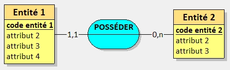
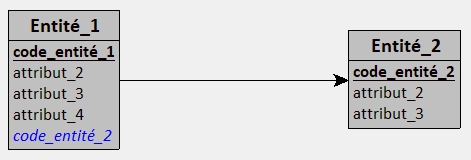
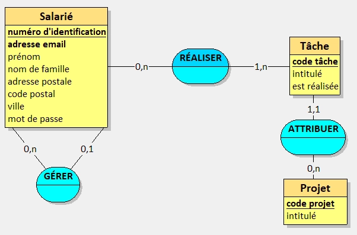
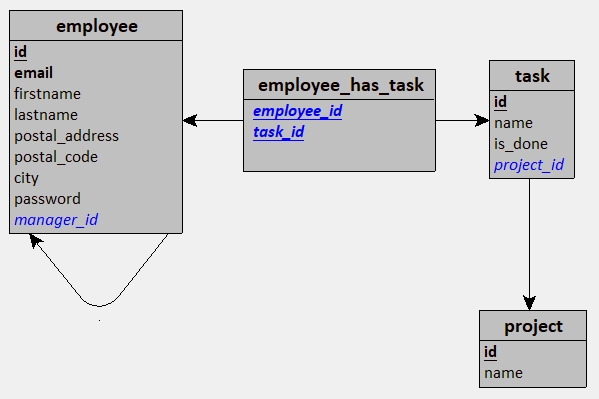

import Admonition from '@theme/Admonition';
import TabItem from '@theme/TabItem';
import Tabs from '@theme/Tabs';

# Modélisation d'une base de données avec Merise

## Introduction

Si jamais tu n'es pas au courant, on recommande _(pour ne pas ainsi dire qu'on oblige 🙃)_ les concepteurs et développeurs d'applications à modéliser leur base de données avant de commencer à coder.

Mais alors, quel est réellement l'intérêt derrière ces schémas qui sont parfois considérés comme faisant partie d'une étape fastidieuse et inutile ?

Eh bien, la modélisation d'une base de données permet de :

- Comprendre les besoins du client final
- Faciliter la communication entre les différents acteurs du projet
- Éviter les erreurs de conception _(ou pas 😅)_

## Modélisation avec Merise

[Merise](https://fr.wikipedia.org/wiki/Merise_(informatique)) est une méthode d'analyse, de conception et de gestion de projet informatique.  
Pour faire plus simple que cette première phrase toute droit sortie de Wikipédia, Merise est une méthode qui permet entre autres de modéliser une base de données.

Même si dans cette documentation on va parler uniquement de la conception qui concerne la base de données,
je t'ai fait un court résumé des différentes étapes principale de la méthode Merise.

## Les différentes étapes principales

1. **L'analyse des besoins** : On commence par recueillir les besoins du client pour notre cahier des charges.
2. **La conception** : On modélise la base de données en utilisant les différents outils de Merise.
3. **L'implémentation** : On passe à la phase de développement en utilisant les modèles créés précédemment.
4. **La mise en service** : On met en service l'application et on la teste.
5. **La maintenance** : On assure la maintenance de l'application.

## Les différents documents

En ce qui concerne les différents documents, on va en retrouver cinq principaux :

- **Le Dictionnaire de Données** : Il contient toutes les informations sur les données qui vont être stockées.
- **Le Modèle Conceptuel de Données _(MCD)_** : Il représente les données et les relations entre ces données.
- **Le Modèle Logique de Données _(MLD)_** : Il ajoute des éléments techniques au MCD.
- **Le Modèle Relationnel de Données _(MRD)_** : Il est une représentation textuelle du MLD.
- **Le Modèle Physique de Données _(MPD)_** : Il ajoute les types de données et les contraintes au MLD.

Bien sûr, il est possible de rajouter d'autres documents en fonction des besoins du projet !  
Mais pour l'instant, on va se concentrer sur ces cinq-là.

### Le Dictionnaire de Données

Le **Dictionnaire de Données** est un document qui contient toutes les informations sur les données qui vont être stockées dans la base de données.

Ici, on ne va pas parler de tables, de colonnes ou de relations, mais uniquement de données. Ces informations nous sont données par le client,
et il est important que le dictionnaire reste compréhensible par le client !

Voici un exemple de dictionnaire de données, à partir des informations données par le client :

<Tabs>
  <TabItem value="employee" label="Salarié">
    | Nom de la donnée     | Type de donnée | Description                                                   | Taille attendue | Taille fixe ? | Exemple(s) de valeur     |
    |----------------------|----------------|---------------------------------------------------------------|-----------------|---------------|--------------------------|
    | adresse email        | Date           | -                                                             | N/A             | N/A           | elodie.martin@exemple.fr |
    | prénom               | Alphabétique   | -                                                             | 50 caractères   | Variable      | Élodie, Christophe       |
    | nom                  | Alphabétique   | -                                                             | 50 caractères   | Variable      | Martin, Dupont           |
    | adresse postale      | Alphanumérique | Numéro de rue, type de voie et nom de la voie                 | N/A             | N/A           | 1 rue de la Paix         |
    | code postal          | Numérique      | -                                                             | 5 caractères    | Fixe          | 75000, 01000             |
    | ville                | Alphabétique   | -                                                             | 50 caractères   | Variable      | Paris, Lyon              |
    | mot de passe         | Alphanumérique | Mot de passé sécurisé _(haché)_                               | 80 caractères   | Variable      | -                        |
    | manager de l'employé | Liaison        | Liaison vers le manager du salarié                            | N/A             | N/A           | N/A                      |
    | employés managés     | Liaison        | Liste des salariés gérés par ce manager _(également salarié)_ | N/A             | N/A           | N/A                      |
  </TabItem>

  <TabItem value="task" label="Tâche">
    | Nom de la donnée          | Type de donnée | Description                             | Taille attendue | Taille fixe ? | Exemple(s) de valeur |
    |---------------------------|----------------|-----------------------------------------|-----------------|---------------|----------------------|
    | nom                       | Alphanumérique | -                                       | 255 caractères  | Variable      | -                    |
    | est réalisée ?            | Vrai/Faux      | Indique si la tâche est réalisée ou non | N/A             | N/A           | Vrai, Faux           |
    | projet                    | Liaison        | Projet auquel la tâche est rattachée    | N/A             | N/A           | N/A                  |
  </TabItem>

  <TabItem value="project" label="Projet">
    | Nom de la donnée | Type de donnée | Description                          | Taille attendue | Taille fixe ? | Exemple(s) de valeur |
    |------------------|----------------|--------------------------------------|-----------------|---------------|----------------------|
    | nom              | Alphanumérique | -                                    | 255 caractères  | Variable      | Mon super projet     |
    | tâches           | Liaison        | Liste des tâches associées au projet | N/A             | N/A           | N/A                  |
  </TabItem>
</Tabs>

Comme tu peux voir, il n'y a aucun terme technique dans ce document 😉  
Cet exemple, on va le mettre de côté car en vrai, il présente quelques notions intermédiaires qui pourraient être déroutantes pour une entrée en matière.

Mais on y reviendra une fois toutes les étapes expliquées, comme ça tu auras un exemple un poil plus concret pour te représenter le lien entre les étapes !

### Le Modèle Conceptuel de Données _(MCD)_

Ce modèle a pour objectif de représenter sous forme graphique les données et les relations entre ces données.  
Avant le MCD, nous sommes en théorie en possession du dictionnaire de données
qui contient toutes les informations qui vont nous être utiles.

Il est important de noter que l'on doit rester le plus clair possible dans la représentation des données,
car ce modèle doit être compris par tout le monde : y compris le client final.

Chaque regroupement de données est appelé une entité, et chaque entité est composée d'attributs.  
Les relations entre les entités sont représentées par trois éléments :
- Un trait reliant les entités _(ou la même entité dans le cas d'une relation réflexive)_
- Un verbe qui décrit la relation à l'**infinitif**
- Une cardinalité pour quantifier la relation entre les entités

<Admonition title="Quelques définitions avant d'aller plus en profondeur">
  - **Entité** : Regroupement de données, représentée par un rectangle jaune dans le schéma ci-dessous.
  - **Attribut** : Propriété d'une entité
      - **Discriminant** _(ou déterminant)_ : Attribut qui permet de distinguer les occurrences d'une entité. Il est souligné et en gras dans le schéma.
      - **Attribut unique** : Attribut qui ne peut pas avoir la même valeur pour deux occurrences d'une entité. Il est en gras dans le schéma.
  - **Relation** : Lien entre deux entités, représentée par un trait reliant les entités.
  - **Cardinalité** : Nombre d'occurrences _(minimum et maximum)_ d'une entité qui peuvent être associées à une occurrence d'une autre entité.
</Admonition>

C'est pas clair ? Prenons alors ce modèle !


Ce modèle nous indique plusieurs choses :

<Tabs>
  <TabItem value="entities" label="Entités">
    - Deux entités sont présentes :
        - `Entité 1` et `Entité 2`
    - L'entité `Entité 1` possède quatre attributs :
        - `code entité 1` _(discriminant)_
        - `attribut 2`
        - `attribut 3`
        - `attribut 4`
    - L'entité `Entité 2` possède trois attributs :
        - `code entité 2` _(discriminant)_
        - `attribut 2`
        - `attribut 3`

    <Admonition type="quote" title="Pourquoi il n'y a pas d'ID dans le schéma ?">
      Avant d'expliquer **pourquoi** il n'y a pas d'ID, je me permets de faire un petit écart pour expliquer **ce qu'est** un ID.

      `ID`, c'est le nom qu'on donne pour parler de l'identifiant qui se doit d'être unique afin d'identifier facilement une ressource d'une autre.  
      
      Il s'agit, en réalité, d'une donnée purement technique.  
      Après tout, c'est pas le client final qui va s'intéresser à l'ID de ses données, n'est-ce pas ?

      Comme le MCD se doit d'être **non-technique**, le terme `ID` n'est donc pas pertinent et surtout : n'a pas sa place.

      En reprenant le schéma ci-dessus, on peut dire que le `code entité 1` et le `code entité 2` sont les déterminants de leurs entités respectives.  
      Une fois qu'on fera nos schémas techniques _(MLD, MRD, MPD)_, on pourra alors utiliser le terme `ID` !
    </Admonition>
  </TabItem>

  <TabItem value="relations" label="Relations et cardinalités">
    - Une relation :
        - Entre `Entité 1` et `Entité 2`
    - Cardinalité :
        - `Entité 1` peut posséder de 1 à 1 occurrence de `Entité 2`
        - `Entité 2` peut être possédée par 0 à n occurrences de `Entité 1`
    - Verbe :
        - `POSSÉDER`
        
    Si on revient à la déclaration faite plus tôt, on remarque qu'il est effectivement à l'**infinitif**.  
    Mais alors, pourquoi c'est important ?

    En fait, le verbe à l'infinitif permet de faciliter la compréhension des relations et ce, dans les deux sens.  
    
    Mais parlons des cardinalités parce qu'on y retrouve quelque chose de bizarre : `n`.  
    C'est quoi `n` ?

    `n` est une valeur qui signifie que l'entité peut être possédée par un nombre indéfini d'occurrences de l'autre entité.
    C'est une notation que l'on retrouvera très fréquemment, puisque la majorité du temps on ne peut pas déterminer le nombre exact d'occurrences.

    <Admonition type="quote" label="Mais est-il possible d'indiquer une valeur définie, comme `42` par exemple ?">
      Oui ! Si tu connais à l'avance le nombre maximal d'occurrences et que ce nombre est fixe _(peu importe le contexte)_, tu peux tout à fait le spécifier.

      Par exemple : demain on te demande de modéliser une base de données avec deux entités `Année` et `Mois`.

      Tu peux donc représenter la relation de cette manière :
      
      > `Année 1,12 - POSSÉDER - 1,1 Mois`  
      > `Année` possède de 1 à 12 occurrences de `Mois`  
      > `Mois` est possédée par une seule occurrence de `Année`

      C'est un exemple simple, mais qui montre bien que c'est possible !
    </Admonition>
  </TabItem>
</Tabs>

Tiens d'ailleurs, autre sujet important pour le **MCD** !

On a vu que certains termes ne sont pas employés _(comme `ID`, mais également `tables`, `clé primaire` ou encore `clé étrangère`)_
pour respecter la nature du document qui se veut non-technique.  
Mais il y a autre chose qui peut nous sauter aux yeux : c'est écrit en français !

La raison est identique à ce que j'ai pu rabâcher plus tôt : le document doit être compris par tout le monde.  
Et si le client final est francophone, il est donc plus simple de lui présenter un document dans sa langue maternelle.

<Admonition type="quote" title="Mouais, toujours pas convaincu par le MCD">
  Tant pis pour toi ! 😜  
  Si je devais te donner un argument majeur, ce serait celui-ci. Après j'abandonne, promis !

  Ton client est un spécialiste dans son domaine, mais toi tu n'y connais rien.  
  Il te parle de certaines données, tu arrives à peu près à comprendre comment ça fonctionne, mais tu n'as pas toutes les informations.

  D'une part, le dictionnaire de données t'en donne la nature et "qui" _(l'entité)_ possède ces données.  
  Par contre, comme le MCD te permet de quantifier et de qualifier les relations entre les entités, tu as une vision plus claire de ce que le client veut.

  Et si le client comprend et valide le MCD, c'est que tu as bien compris ses besoins et que tu peux donc passer à la suite du projet sans foncer dans le mur,
  ce qui t'obligerai de déconstruire et de reconstruire une partie de ton application.
</Admonition>

### Le Modèle Logique de Données _(MLD)_

À partir de maintenant, on "abandonne" le client et on dit bonjour à la technique ! ⚙️

Le **Modèle Logique de Données** est une étape intermédiaire entre le MCD et le MPD.  
Il se base de manière directe sur le MCD, mais il ajoute des éléments techniques qui vont permettre de nous assurer **avant** de faire
la base de données que tout est correct.

En reprenant l'exemple donné pour le MCD, voici le MLD correspondant.



Ici, on ne parle plus d'entités, mais de tables.  
Et ce qui était souligné avant _(les déterminants)_ devient des clés primaires.
De manière générale, on y retrouvera le terme `id` pour les clés primaires même si ce n'est pas une obligation.

<Admonition type="quote" title="Où qu'elles sont les relations ?">
  Bien vu ! Elles sont totalement disparues... enfin presque.

  Si tu regardes de plus près, tu peux voir que la table nommée `table_1` s'est vue ajouter une colonne `table_2_id`.
  Mais qu'est-ce que c'est ?

  Il s'agit d'une référence vers la table `table_2` : c'est ce qu'on appelle une **clé étrangère**.  
  Le but des clés étrangères est de lier les tables entre elles, et donc de recréer les relations que l'on avait dans le MCD.

  Une clé étrangère pointe systématiquement vers une clé primaire d'une autre table _(ou de la même table dans le cas d'une relation réflexive)_.
  Dans cet exemple, la clé étrangère `table_2_id` de la table `table_1` est une référence à la clé primaire `id` de la table `table_2`.
</Admonition>

Maintenant, j'ai une question pour vous... est-ce que vous savez ce qu'il se passe quand dans notre MCD,
une relation à une cardinalité avec un `n` pour le maximum des deux côtés ? _(`0,n` ou `1,n` par exemple)_

Eh bien... on se retrouve avec une table intermédiaire !  
Cette table peut se nommer de différentes manières.
Pour ma part, j'appelle ça une "table pivot" même si on peut également parler de "table de liaison"
ou encore de "table de jointure" _(et sans doute d'autres termes !)_.

<Admonition type="quote" title="Table pivot ? Kézako ?">
  Le but d'une table pivot est de permettre de lier deux tables entre elles lorsque la relation entre ces deux tables est de type `n`.
  
  Cette table va stocker **uniquement** _(sauf besoin spécifique)_ la valeur des clés primaires des deux tables qu'elle relie.
  Et si tu as bien suivi, ces deux colonnes seront des clés étrangères qui pointeront vers les clés primaires des tables qu'elles relient 😉
</Admonition>

### Le Modèle Relationnel de Données _(MRD)_

Souffle un coup, parce qu'on vient de voir était quand même déjà pas mal costaud ! 🥵

C'est le moment détente, parce que le **Modèle Relationnel de Données** est en fait une simple représentation textuelle de notre MLD.  
Pas besoin donc de schéma, juste une liste de tables avec leurs colonnes !

Et toujours à partir de notre exemple, voici le MRD correspondant.

> table_1(<u className='font-bold'>id</u>, colonne_2, colonne_3, colonne_4, <i className="italic">#table_2_id</i>)  
> table_2(<u className='font-bold'>id</u>, colonne_2, colonne_3)

Tu as vu ? Rien de bien méchant !

On vient reprendre une partie de l'écriture que l'on retrouve dans le MLD, mais on ajoute des symboles pour indiquer les clés étrangères.

Le symbole `#` est utilisé pour indiquer une clé étrangère, en préfixe du nom de la colonne.

Tu sais maintenant ce qu'il manque comme ajout majeur pour passer du MRD au MPD ?  
Je te le donne en mille : les **types de données** et leurs **contraintes** !

### Le Modèle Physique de Données _(MPD)_

Avant toute chose, permet moi de t'imposer _(tel le manitou que je suis 😆)_ une petite révision des types de données que l'on retrouve en SQL.  
Et comme je ne suis pas méchant, voici une liste des types selon les SGBD les plus utilisés :

- [**PostgreSQL**](https://www.postgresql.org/docs/current/datatype.html)
- [**MySQL**](https://dev.mysql.com/doc/refman/9.0/en/data-types.html)
- [**SQL Server**](https://docs.microsoft.com/en-us/sql/t-sql/data-types/data-types-transact-sql?view=sql-server-ver15)
- [**SQLite**](https://www.sqlite.org/datatype3.html)
- [**Oracle**](https://docs.oracle.com/en/database/oracle/oracle-database/23/sqlrf/Data-Types.html)

_(Désolé pour les autres SGBD, mais je ne peux pas tout mettre 😅)_

<Admonition type="quote" title="Mais pourquoi il me bassine avec les types de données ?">
  Parce que c'est important !  
  Les types de données permettent de définir le format des données que l'on va stocker dans notre base de données.

  Chaque SGBD fixe ses propres types de données, mais on retrouve des similitudes entre eux.  
  On peut d'ailleurs retrouver quelque chose de très différent du côté de
  [**MongoDB**](https://docs.mongodb.com/manual/reference/bson-types/) qui est une base de données NoSQL.
</Admonition>

Maintenant que tu as révisé, on peut réellement passer au **Modèle Physique de Données** !

Le but du MPD est de se baser sur le MLD et d'y ajouter les types de données et les contraintes _(comme les clés primaires par exemple)_.  
Bien que c'était déjà le cas dans le MLD, le MPD est plus précis et plus technique.

Le MPD peut se représenter de deux manières différentes :

- Un script pour créer la base de données
- Un schéma visuel _(encore un..)_ de la base de données

Je ne vais pas m'attarder sur le schéma visuel, car il est très similaire au MLD avec uniquement les types de données et les contraintes en plus.

Par contre, je vais te montrer un exemple de script pour créer une base de données à partir de notre MLD.

```sql title="MPD sous forme de script SQL" showLineNumbers
CREATE TABLE IF NOT EXISTS table_1(
   id INT PRIMARY KEY,
   colonne_2 VARCHAR(50) NOT NULL,
   colonne_3 VARCHAR(80),
   colonne_4 TINYINT DEFAULT 0,
   table_2_id INT
);

CREATE TABLE IF NOT EXISTS table_2(
   id INT PRIMARY KEY,
   colonne_2 VARCHAR(50) NOT NULL,
   colonne_3 DATE
);

ALTER TABLE table_1
ADD FOREIGN KEY (table_2_id) REFERENCES table_2(id);
```

Et voilà !  
Bien sûr, ce script est un exemple très simple, mais il te montre comment on peut passer d'un MLD à un MPD.

## Exemple concret

Tu te souviens du dictionnaire de données que je t'avais montré plus tôt ? Je t'avais dit qu'on y reviendrai plus tard : **c'est l'heure** !

Reprenons donc le dictionnaire de données précédent _(que je te remet juste ici, ce sera plus simple 😉)_ et voyons commen t tout s'articule au niveau des étapes et modèles de conception.

<Tabs>
  <TabItem value="employee" label="Salarié">
    | Nom de la donnée     | Type de donnée | Description                                                   | Taille attendue | Taille fixe ? | Exemple(s) de valeur     |
    |----------------------|----------------|---------------------------------------------------------------|-----------------|---------------|--------------------------|
    | adresse email        | Date           | -                                                             | N/A             | N/A           | elodie.martin@exemple.fr |
    | prénom               | Alphabétique   | -                                                             | 50 caractères   | Variable      | Élodie, Christophe       |
    | nom                  | Alphabétique   | -                                                             | 50 caractères   | Variable      | Martin, Dupont           |
    | adresse postale      | Alphanumérique | Numéro de rue, type de voie et nom de la voie                 | N/A             | N/A           | 1 rue de la Paix         |
    | code postal          | Numérique      | -                                                             | 5 caractères    | Fixe          | 75000, 01000             |
    | ville                | Alphabétique   | -                                                             | 50 caractères   | Variable      | Paris, Lyon              |
    | mot de passe         | Alphanumérique | Mot de passé sécurisé _(haché)_                               | 80 caractères   | Variable      | -                        |
    | manager de l'employé | Liaison        | Liaison vers le manager du salarié                            | N/A             | N/A           | N/A                      |
    | employés managés     | Liaison        | Liste des salariés gérés par ce manager _(également salarié)_ | N/A             | N/A           | N/A                      |
  </TabItem>

  <TabItem value="task" label="Tâche">
    | Nom de la donnée          | Type de donnée | Description                             | Taille attendue | Taille fixe ? | Exemple(s) de valeur |
    |---------------------------|----------------|-----------------------------------------|-----------------|---------------|----------------------|
    | nom                       | Alphanumérique | -                                       | 255 caractères  | Variable      | -                    |
    | est réalisée ?            | Vrai/Faux      | Indique si la tâche est réalisée ou non | N/A             | N/A           | Vrai, Faux           |
    | projet                    | Liaison        | Projet auquel la tâche est rattachée    | N/A             | N/A           | N/A                  |
  </TabItem>

  <TabItem value="project" label="Projet">
    | Nom de la donnée | Type de donnée | Description                          | Taille attendue | Taille fixe ? | Exemple(s) de valeur |
    |------------------|----------------|--------------------------------------|-----------------|---------------|----------------------|
    | nom              | Alphanumérique | -                                    | 255 caractères  | Variable      | Mon super projet     |
    | tâches           | Liaison        | Liste des tâches associées au projet | N/A             | N/A           | N/A                  |
  </TabItem>
</Tabs>

Dans le MCD, on retrouvera donc trois entités : `Salarié`, `Tâche` et `Projet`.  
Et biensûr, on n'oubliera pas les attributs de ces entités !



Ici on va remarquer trois relations, dont une réflexive _(le manager de l'employé)_.  
Sur le papier, voici comment on peut parler de ces relations :

- `Salarié` 0,n - GÉRER - 0,1 `Salarié`
    - Un salarié peut gérer plusieurs salariés
    - Un salarié peut être géré par aucun ou un seul salarié
- `Salarié` 0,n - RÉALISER - 1,n `Tâche`
    - Un salarié peut réaliser plusieurs tâches
    - Une tâche doit être réalisée par au moins un salarié
- `Tâche` 1,1 - ATTRIBUER - 0,n `Projet`
    - Une tâche est attribuée à un seul projet
    - Un projet peut avoir aucune ou plusieurs tâches attribuées

On peut donc en déduire que l'on va avoir une table pivot entre `Salarié` et `Tâche` pour la relation `RÉALISER` car des deux côtés on retrouve le fameux `n` qui indique qu'il peut y avoir plusieurs occurrences.

Ensuite, on passe au MLD, où l'on va transformer nos entités en tables et nos attributs en colonnes.



Et là, magie ! On retrouve bien une table pivot entre l'entité `Salarié` _(devenue `employee`)_ et l'entité `Tâche` _(devenue `task`)_ pour la relation `RÉALISER`, qui se nomme `employee_has_task`.  
Dedans, on y retrouve deux clés étrangères : `employee_id` et `task_id`.

On peut également constater que pour la relation `GÉRER`, on a une clé étrangère `manager_id` dans la table `employee`.  
Cette clé étrangère pointera vers la clé primaire `id` de la table `employee`, mais on verra ça plus facilement à partir du MPD avec un script SQL !

Pour le MRD, voici à quoi ça ressemble :

> employee(<u class="font-bold underline">id</u>, **email**, firstname, lastname, postal_address, postal_code, city, password, <i class="italic">#manager_id</i>);  
> project(<u class="font-bold underline">id</u>, name);  
> task(<u class="font-bold underline">id</u>, name, is_done, <i class="italic">#project_id</i>);  
> employee_has_task(#employee_id, <i class="italic">#task_id</i>);